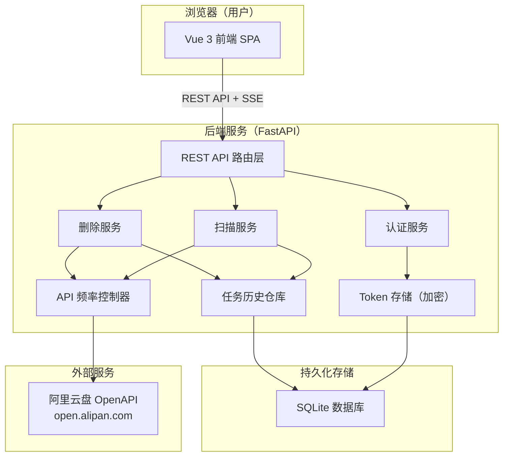
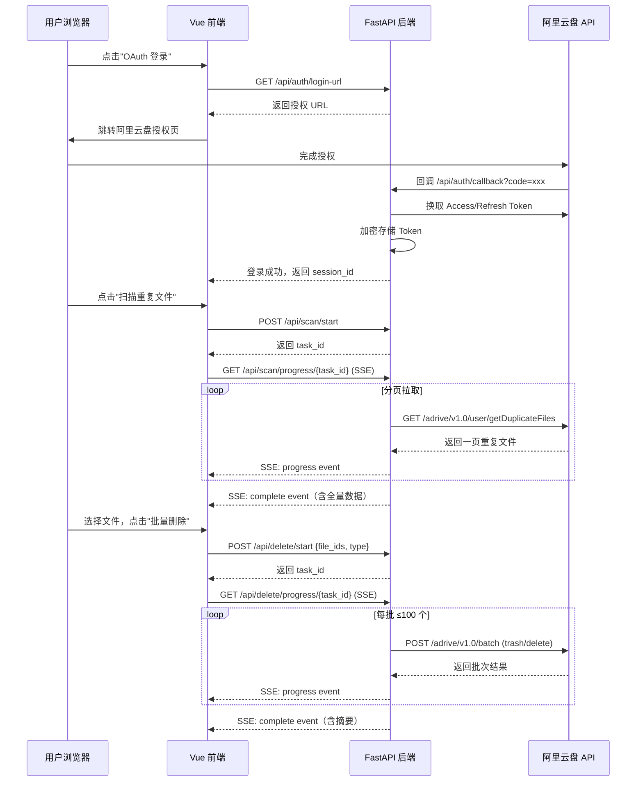
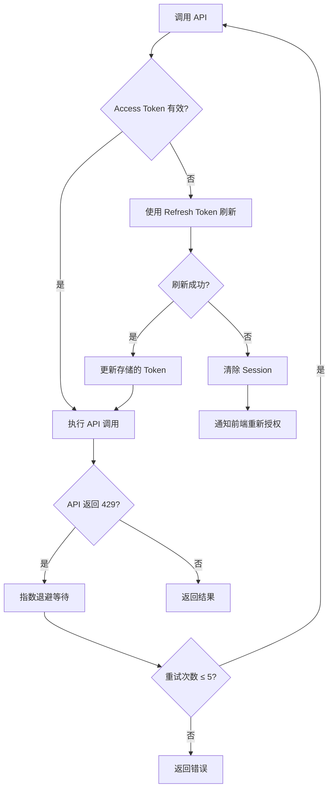

# 设计文档：阿里云盘重复文件批量清理工具

## 概述

本系统是一个前后端分离的 Web 应用，通过调用阿里云盘官方 OpenAPI，突破官方界面每次仅能操作几百个文件的限制，支持一次性获取全量重复文件列表并进行批量删除（移至回收站或永久删除）。

### 核心设计目标

- **高效处理**：支持几十万级别重复文件的扫描与批量操作
- **实时反馈**：通过 SSE（Server-Sent Events）向前端推送扫描和删除进度
- **安全可靠**：Token 服务端存储、操作二次确认、指数退避重试
- **前后端分离**：Vue 3 前端 + FastAPI 后端，通过 REST API + SSE 通信

### 技术选型

| 层次 | 技术 |
|------|------|
| 前端 | Vue 3 + TypeScript + Vite + Pinia + Element Plus |
| 后端 | Python 3.11 + FastAPI + SQLite（SQLAlchemy ORM） |
| 实时推送 | Server-Sent Events（SSE） |
| 任务调度 | Python asyncio + 后台任务（FastAPI BackgroundTasks） |
| 数据存储 | SQLite（轻量部署，单用户场景） |
| 认证 | 阿里云盘 OAuth 2.0（PKCE 授权码流程） |

**选择 SSE 而非 WebSocket 的理由**：扫描和删除进度均为服务端单向推送，SSE 实现更简单，无需维护双向连接，且对代理/防火墙兼容性更好。

---

## 架构

### 系统架构图



### 请求流程



---

## 组件与接口

### 后端组件

#### 1. 认证服务（AuthService）

负责 OAuth 2.0 授权流程、Token 管理与自动刷新。

```
AuthService
├── generate_auth_url() -> str
├── exchange_code_for_token(code: str) -> TokenPair
├── refresh_access_token(session_id: str) -> AccessToken
├── get_valid_access_token(session_id: str) -> str  # 自动刷新
├── revoke_session(session_id: str) -> None
└── is_authenticated(session_id: str) -> bool
```

#### 2. 扫描服务（ScanService）

负责分页拉取全量重复文件，通过 SSE 推送进度。

```
ScanService
├── start_scan(session_id: str) -> str  # 返回 task_id
├── get_scan_progress(task_id: str) -> AsyncGenerator[ScanEvent]
└── _fetch_all_duplicates(session_id: str, task_id: str) -> None  # 后台任务
```

#### 3. 删除服务（DeleteService）

负责批量删除（移至回收站或永久删除），通过 SSE 推送进度。

```
DeleteService
├── start_delete(session_id: str, file_ids: list[str], delete_type: DeleteType) -> str
├── get_delete_progress(task_id: str) -> AsyncGenerator[DeleteEvent]
└── _execute_batch_delete(session_id: str, task_id: str, ...) -> None  # 后台任务
```

#### 4. API 频率控制器（RateLimiter）

实现调用间隔控制与指数退避重试。

```
RateLimiter
├── call_with_rate_limit(coro, *args) -> Any
├── _exponential_backoff(attempt: int) -> float
└── config: RateLimitConfig  # 可配置间隔、重试次数等
```

#### 5. 阿里云盘 API 客户端（AliyunDriveClient）

封装所有对阿里云盘 OpenAPI 的调用。

```
AliyunDriveClient
├── get_duplicate_files(access_token: str, marker: str | None) -> DuplicateListPage
├── batch_trash(access_token: str, file_ids: list[str]) -> BatchResult
├── batch_delete_permanently(access_token: str, file_ids: list[str]) -> BatchResult
└── refresh_token(refresh_token: str) -> TokenPair
```

#### 6. 任务历史仓库（TaskRepository）

负责任务历史的持久化存储与查询。

```
TaskRepository
├── create_task(task: TaskCreate) -> Task
├── update_task(task_id: str, update: TaskUpdate) -> Task
├── get_task(task_id: str) -> Task
├── list_tasks(session_id: str) -> list[TaskSummary]
└── get_task_files(task_id: str) -> list[TaskFile]
```

### 前端组件

```
src/
├── views/
│   ├── LoginView.vue          # OAuth 登录页
│   ├── ScanView.vue           # 扫描与文件列表主页
│   └── HistoryView.vue        # 任务历史页
├── components/
│   ├── DuplicateGroupList.vue # 重复文件分组列表
│   ├── DuplicateGroupItem.vue # 单个分组（可展开）
│   ├── FilterBar.vue          # 搜索/筛选/排序工具栏
│   ├── StatsSummary.vue       # 汇总统计信息
│   ├── SelectionToolbar.vue   # 批量选择操作栏
│   ├── DeleteConfirmDialog.vue # 删除确认弹窗（回收站）
│   ├── PermanentDeleteDialog.vue # 永久删除二次确认弹窗
│   ├── ProgressPanel.vue      # 实时进度展示
│   └── TaskHistoryDetail.vue  # 历史任务详情
├── stores/
│   ├── auth.ts                # 认证状态
│   ├── scan.ts                # 扫描结果与进度
│   ├── selection.ts           # 文件选择状态
│   └── task.ts                # 任务历史
├── composables/
│   ├── useSSE.ts              # SSE 连接封装
│   ├── useFileFilter.ts       # 筛选/排序逻辑
│   └── useSelection.ts        # 选择逻辑（含防误删保护）
└── api/
    └── client.ts              # Axios HTTP 客户端
```

### REST API 接口定义

#### 认证接口

| 方法 | 路径 | 描述 |
|------|------|------|
| GET | `/api/auth/login-url` | 获取 OAuth 授权 URL |
| GET | `/api/auth/callback` | OAuth 回调，换取 Token |
| GET | `/api/auth/status` | 检查登录状态 |
| POST | `/api/auth/logout` | 退出登录 |

#### 扫描接口

| 方法 | 路径 | 描述 |
|------|------|------|
| POST | `/api/scan/start` | 启动扫描任务，返回 task_id |
| GET | `/api/scan/progress/{task_id}` | SSE 流，推送扫描进度与结果 |

#### 删除接口

| 方法 | 路径 | 描述 |
|------|------|------|
| POST | `/api/delete/start` | 启动删除任务，返回 task_id |
| GET | `/api/delete/progress/{task_id}` | SSE 流，推送删除进度 |

#### 历史记录接口

| 方法 | 路径 | 描述 |
|------|------|------|
| GET | `/api/tasks` | 获取任务历史列表 |
| GET | `/api/tasks/{task_id}` | 获取任务详情（含文件列表） |

---

## 数据模型

### 数据库表结构

#### sessions 表（Token 存储）

```sql
CREATE TABLE sessions (
    id          TEXT PRIMARY KEY,          -- session_id (UUID)
    user_id     TEXT NOT NULL,             -- 阿里云盘用户 ID
    nickname    TEXT,                      -- 用户昵称
    access_token_enc  TEXT NOT NULL,       -- 加密存储的 Access Token
    refresh_token_enc TEXT NOT NULL,       -- 加密存储的 Refresh Token
    token_expires_at  INTEGER NOT NULL,    -- Access Token 过期时间戳
    created_at  INTEGER NOT NULL,
    updated_at  INTEGER NOT NULL
);
```

#### tasks 表（任务历史）

```sql
CREATE TABLE tasks (
    id              TEXT PRIMARY KEY,      -- task_id (UUID)
    session_id      TEXT NOT NULL,
    delete_type     TEXT NOT NULL,         -- 'trash' | 'permanent'
    status          TEXT NOT NULL,         -- 'running' | 'completed' | 'failed'
    total_count     INTEGER NOT NULL DEFAULT 0,
    success_count   INTEGER NOT NULL DEFAULT 0,
    failed_count    INTEGER NOT NULL DEFAULT 0,
    freed_bytes     INTEGER NOT NULL DEFAULT 0,
    started_at      INTEGER NOT NULL,
    completed_at    INTEGER,
    FOREIGN KEY (session_id) REFERENCES sessions(id)
);
```

#### task_files 表（任务文件明细）

```sql
CREATE TABLE task_files (
    id          INTEGER PRIMARY KEY AUTOINCREMENT,
    task_id     TEXT NOT NULL,
    file_id     TEXT NOT NULL,             -- 阿里云盘文件 ID
    file_name   TEXT NOT NULL,
    file_path   TEXT NOT NULL,
    file_size   INTEGER NOT NULL DEFAULT 0,
    result      TEXT NOT NULL,             -- 'success' | 'failed' | 'skipped'
    error_msg   TEXT,
    FOREIGN KEY (task_id) REFERENCES tasks(id)
);
CREATE INDEX idx_task_files_task_id ON task_files(task_id);
```

### 核心 Python 数据模型（Pydantic）

```python
class DuplicateFile(BaseModel):
    file_id: str
    file_name: str
    file_path: str
    file_size: int          # 字节
    content_hash: str       # SHA1 哈希
    modified_at: datetime
    file_type: FileType     # 枚举：video/image/audio/document/archive/other

class DuplicateGroup(BaseModel):
    group_id: str           # content_hash 作为组 ID
    file_name: str          # 代表性文件名
    file_size: int
    content_hash: str
    duplicate_count: int    # 副本数量
    file_type: FileType
    files: list[DuplicateFile]

class ScanResult(BaseModel):
    task_id: str
    total_groups: int
    total_files: int
    total_size_bytes: int
    groups: list[DuplicateGroup]

class DeleteRequest(BaseModel):
    file_ids: list[str]
    delete_type: Literal["trash", "permanent"]

class TaskSummary(BaseModel):
    task_id: str
    delete_type: str
    status: str
    total_count: int
    success_count: int
    failed_count: int
    freed_bytes: int
    started_at: datetime
    completed_at: datetime | None
```

### SSE 事件格式

```python
# 扫描进度事件
class ScanProgressEvent(BaseModel):
    event: Literal["progress"] = "progress"
    fetched_count: int       # 已获取文件数
    total_count: int | None  # 总数（若 API 提供）
    percentage: float        # 0.0 ~ 100.0

# 扫描完成事件
class ScanCompleteEvent(BaseModel):
    event: Literal["complete"] = "complete"
    result: ScanResult

# 扫描错误事件
class ScanErrorEvent(BaseModel):
    event: Literal["error"] = "error"
    message: str
    partial_result: ScanResult | None  # 已获取的部分数据

# 删除进度事件
class DeleteProgressEvent(BaseModel):
    event: Literal["progress"] = "progress"
    processed_count: int
    total_count: int
    success_count: int
    failed_count: int
    percentage: float

# 删除完成事件
class DeleteCompleteEvent(BaseModel):
    event: Literal["complete"] = "complete"
    task_id: str
    success_count: int
    failed_count: int
    freed_bytes: int
    failed_files: list[FailedFile]
```

### 文件类型分类规则

```python
FILE_TYPE_MAP: dict[str, FileType] = {
    # 视频
    "mp4": FileType.VIDEO, "mkv": FileType.VIDEO, "avi": FileType.VIDEO,
    "mov": FileType.VIDEO, "wmv": FileType.VIDEO, "flv": FileType.VIDEO,
    "webm": FileType.VIDEO, "m4v": FileType.VIDEO, "ts": FileType.VIDEO,
    # 图片
    "jpg": FileType.IMAGE, "jpeg": FileType.IMAGE, "png": FileType.IMAGE,
    "gif": FileType.IMAGE, "bmp": FileType.IMAGE, "webp": FileType.IMAGE,
    "heic": FileType.IMAGE, "heif": FileType.IMAGE, "tiff": FileType.IMAGE,
    # 音频
    "mp3": FileType.AUDIO, "flac": FileType.AUDIO, "wav": FileType.AUDIO,
    "aac": FileType.AUDIO, "ogg": FileType.AUDIO, "m4a": FileType.AUDIO,
    "wma": FileType.AUDIO, "opus": FileType.AUDIO,
    # 文档
    "pdf": FileType.DOCUMENT, "doc": FileType.DOCUMENT, "docx": FileType.DOCUMENT,
    "xls": FileType.DOCUMENT, "xlsx": FileType.DOCUMENT, "ppt": FileType.DOCUMENT,
    "pptx": FileType.DOCUMENT, "txt": FileType.DOCUMENT, "md": FileType.DOCUMENT,
    "csv": FileType.DOCUMENT, "epub": FileType.DOCUMENT,
    # 压缩包
    "zip": FileType.ARCHIVE, "rar": FileType.ARCHIVE, "7z": FileType.ARCHIVE,
    "tar": FileType.ARCHIVE, "gz": FileType.ARCHIVE, "bz2": FileType.ARCHIVE,
    "xz": FileType.ARCHIVE, "zst": FileType.ARCHIVE,
}
# 其余扩展名 -> FileType.OTHER
```

---

## 正确性属性

*属性（Property）是在系统所有有效执行中都应成立的特征或行为——本质上是对系统应做什么的形式化陈述。属性是人类可读规范与机器可验证正确性保证之间的桥梁。*

### 属性 1：文件类型分类的完备性与确定性

*对于任意* 文件名字符串（包括空字符串、无扩展名、多点号、大小写混合等边界情况），`classify_file_type(filename)` 函数必须返回且仅返回一个有效的 `FileType` 枚举值，不得抛出异常，且对相同输入始终返回相同结果（纯函数）。

**验证：需求 3.8**

### 属性 2：多条件筛选的正确性与交集语义

*对于任意* 重复文件组列表，以及任意文件类型筛选条件、关键词搜索字符串和排序方向的组合，筛选后的结果集必须满足：(a) 每个结果组的 `file_type` 符合类型筛选条件；(b) 每个结果组的文件名包含关键词（大小写不敏感）；(c) 结果集是两个筛选条件各自独立结果的交集；(d) 排序仅改变元素顺序，不改变元素集合。

**验证：需求 3.2、3.6、3.7、3.9**

### 属性 3：汇总统计与当前可见列表的一致性

*对于任意* 筛选条件下的重复文件组列表，汇总统计信息（组总数、副本总数、可释放空间字节数）必须等于当前可见列表中所有组对应字段的精确聚合值，与全量数据无关，且在选择状态变化时实时更新。

**验证：需求 3.5、3.7、4.6**

### 属性 4：防误删全组保护的不变性

*对于任意* 重复文件组（包含 N 个副本，N ≥ 2）和任意选择操作序列（包括全选、一键保留最新/最早、手动勾选），执行操作后该组的未选中副本数量必须 ≥ 1。即系统不得允许某组所有副本同时处于选中状态。

**验证：需求 4.3、4.7**

### 属性 5：保留策略选择的正确性

*对于任意* 重复文件组（包含 N 个副本，N ≥ 2），执行"保留最新版本"操作后，被选中的文件集合必须等于除修改时间最晚的文件之外的所有副本；执行"保留最早版本"操作后，被选中的文件集合必须等于除修改时间最早的文件之外的所有副本。

**验证：需求 4.1、4.2**

### 属性 6：批量删除分批的完备性与边界约束

*对于任意* 包含 M 个文件 ID 的删除请求（M 为任意非负整数），后端将其拆分为批次后必须满足：(a) 每个批次包含的文件 ID 数量 ≤ 100；(b) 所有批次的文件 ID 集合的并集等于原始请求的文件 ID 集合（无遗漏）；(c) 所有批次的文件 ID 集合两两不相交（无重复）。

**验证：需求 5.2、9.5**

### 属性 7：删除结果摘要的数量不变量

*对于任意* 删除任务执行结果，任务摘要中的成功数量与失败数量之和必须等于原始请求的文件 ID 总数，且每个文件 ID 在结果中有且仅有一个状态（成功或失败）。

**验证：需求 5.4、9.7**

### 属性 8：删除操作的幂等性

*对于任意* 包含已不存在文件 ID 的删除请求，这些不存在的文件 ID 必须被计入成功数量而非失败数量，且不影响其他文件 ID 的处理结果。

**验证：需求 5.6、9.10**

### 属性 9：指数退避等待时间的单调递增性与上界约束

*对于任意* 重试次数 n（0 ≤ n ≤ 4），指数退避计算函数返回的等待时间必须满足：`wait(n) ≤ wait(n+1)`（单调不减），且对所有 n，`wait(n) ≤ 60`（最大等待时间上限）。

**验证：需求 8.2**

### 属性 10：任务历史持久化的 Round-Trip 完整性

*对于任意* 删除任务记录（包含任意 `delete_type`、任意计数值、任意时间戳），将其持久化存储后再查询，返回的记录必须与存储时的数据完全一致，包括 `delete_type` 字段（区分"trash"与"permanent"）。

**验证：需求 7.1、9.9**

### 属性 11：永久删除确认文本的精确匹配验证

*对于任意* 用户输入字符串，永久删除确认按钮的激活状态必须满足：当且仅当输入字符串与指定确认文本完全相同（区分大小写）时，按钮处于激活状态；任何其他字符串（包括前缀、后缀、大小写变体、空白字符差异）均不得激活按钮。

**验证：需求 9.3**

---

## 错误处理

### 错误分类与处理策略

| 错误类型 | 触发条件 | 处理策略 |
|----------|----------|----------|
| Token 过期 | API 返回 401 | 自动使用 Refresh Token 刷新，透明重试 |
| Refresh Token 失效 | 刷新请求返回 401/400 | 通知前端要求重新授权，清除 session |
| API 限流（429） | 阿里云盘返回 429 | 指数退避重试，最多 5 次，最大等待 60s |
| 网络超时 | 请求超时（默认 30s） | 按指数退避重试，最多 3 次 |
| 批次删除失败 | 单批次 API 调用失败 | 记录错误，继续处理后续批次，最终汇总失败列表 |
| 文件不存在（幂等） | 删除时文件已不存在 | 计入成功，不视为错误 |
| 扫描中断 | 扫描过程中发生不可恢复错误 | 通过 SSE 推送 error 事件，返回已获取的部分数据 |
| 前端 SSE 断连 | 网络中断 | 前端自动重连（EventSource 原生支持），后台任务继续执行 |

### Token 刷新流程



### 前端错误处理

- **网络错误**：显示 Toast 提示，提供重试按钮
- **认证失效**：自动跳转登录页，保留当前操作状态（localStorage）
- **SSE 断连**：显示重连提示，EventSource 自动重连
- **删除部分失败**：在结果摘要中高亮显示失败文件列表，提供导出功能

---

## 测试策略

### 双轨测试方法

本项目采用单元测试（含属性测试）与集成测试相结合的方式。

### 属性测试（Property-Based Testing）

使用 **Hypothesis**（Python PBT 库）对核心业务逻辑进行属性测试，每个属性测试运行最少 100 次迭代。

每个属性测试须在注释中标注对应的设计属性：
```python
# Feature: aliyundrive-duplicate-cleaner, Property 1: 文件类型分类的完备性与确定性
@given(st.text())
@settings(max_examples=200)
def test_classify_file_type_always_returns_valid_type(filename: str):
    result = classify_file_type(filename)
    assert isinstance(result, FileType)
```

**属性测试覆盖范围**：

| 属性 | 测试函数 | 生成器策略 |
|------|----------|------------|
| 属性 1：文件类型分类完备性 | `test_classify_file_type_always_returns_valid_type` | `st.text()` 任意文件名 |
| 属性 2：多条件筛选正确性与交集语义 | `test_combined_filters_are_intersection` | 随机 `DuplicateGroup` 列表 + 随机类型/关键词/排序组合 |
| 属性 3：统计与可见列表一致性 | `test_stats_match_visible_list` | 随机文件组列表 + 随机筛选条件 |
| 属性 4：防误删全组保护 | `test_selection_always_keeps_one_per_group` | 随机文件组 + 随机选择操作序列 |
| 属性 5：保留策略选择正确性 | `test_keep_strategy_selects_correct_files` | 随机文件组（含随机修改时间） |
| 属性 6：批量分批完备性与边界约束 | `test_batch_split_covers_all_ids` | 随机长度的文件 ID 列表（0 ~ 10000） |
| 属性 7：删除结果摘要不变量 | `test_delete_result_counts_invariant` | 随机成功/失败分布的批次结果 |
| 属性 8：删除幂等性 | `test_delete_idempotent_for_nonexistent_files` | 随机文件 ID 集合（含已删除文件） |
| 属性 9：退避时间单调递增与上界 | `test_backoff_is_monotonically_increasing` | `st.integers(min_value=0, max_value=4)` |
| 属性 10：任务历史 Round-Trip | `test_task_persistence_round_trip` | 随机任务数据（含随机 delete_type） |
| 属性 11：确认文本精确匹配 | `test_confirm_text_exact_match_only` | `st.text()` 任意输入字符串 |

### 单元测试

使用 **pytest** 编写，覆盖以下场景：

- **认证服务**：Token 刷新逻辑、Session 管理、加密存储
- **文件类型分类**：各类型扩展名的正确分类、大小写不敏感、无扩展名文件
- **批量分批逻辑**：边界值（0、1、100、101、200 个文件）
- **幂等处理**：文件不存在时的处理逻辑
- **SSE 事件格式**：事件序列化/反序列化

### 集成测试

使用 **pytest + httpx** 对 FastAPI 路由进行集成测试，使用 Mock 替代阿里云盘 API：

- OAuth 回调流程
- 扫描任务启动与 SSE 进度推送
- 删除任务执行与结果汇总
- 任务历史记录的持久化与查询
- API 限流触发时的重试行为

### 前端测试

使用 **Vitest + Vue Test Utils** 进行组件测试：

- `useSelection` composable：选择逻辑与防误删保护
- `useFileFilter` composable：筛选、搜索、排序逻辑
- `DeleteConfirmDialog`：确认文本输入验证
- `StatsSummary`：统计数据计算正确性
